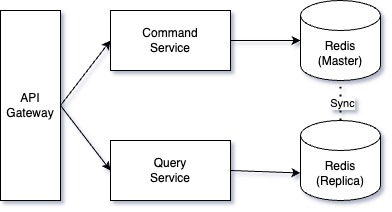

# Distributed Cache - Node

A functional prototype of a cache "node" for a distributed cache system.

The application is written in Java and Spring Boot, and it is covered with integration and end-to-end tests.

Given the time constraint for this project, and the prototype nature of the project itself, the project presents some limitations:
- As Redis Cluster is not supported in Docker, I decided to use a simple master-replica Redis setup, which was compatible with Docker.
- I decided to store simple key/value String pairs, instead of more complex objects.

## Architecture Diagram



## Setup (MacOS)

First, create an `.env` file by coping the existing `.env.example`, and modify it as needed.

```sh
cp .env.example .env
```

Then, source the `.env` file by running the following command:

```sh
source .env
```

After that, create the two Redis instances (master + replica) with the following command:

```sh
docker compose up -d
```

Finally, run the application with the following command:

```sh
./gradlew bootRun
```

## Run the tests
To run the tests with Gradle use the following command:

```sh
$ gradlew clean test
```

## API endpoints

The following API endpoints are available:

- GET `/cache/{key}` - Retrieves a cache entry
  - Throws a 404 exception if key is not found
- PUT `/cache/{key}` - Creates, or updates, a specific cache entry
- DELETE `/cache/{key}` - Deletes a specific cache entry
  - Throws a 404 exception if key is not found

## Postman

In the `postman` folder you can find a collection and an environment file that you can import in Postman, or similar tool (?), to easily test the API.
